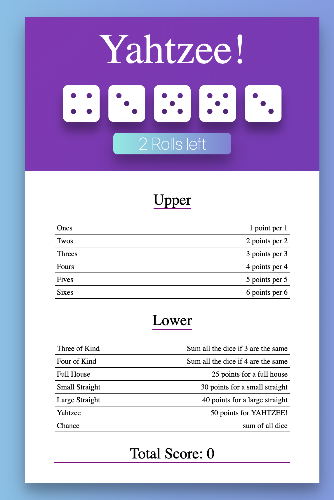

<h1>Yahtzee Dice Game</h1>

A react game built of several compnents

<ul>
    <li>Game component</li>
    <li>Dice component</li>
    <li>Die component</li>
    <li>Score Table component</li>
    <li>Rule row component</li>
</ul>

The game is fully functional but can have better css styling.

To run from terminal: cd into react-yahtzee folder and install all dependencies using: $npm install then run: $npm start .

